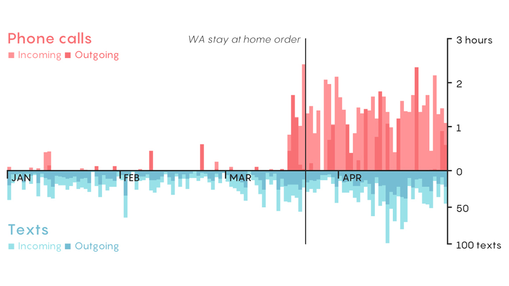

# Plotting my phone data downloaded through call logs

Code to make a quick graphic plotting all my incoming and outgoing calls in January ~ April 2020.

I followed the instructions [here](https://www.t-mobile.com/support/account/print-phone-records) to download my call records from T-Mobile, but I assume other providers have similar resources for billing. 

The second cell in the Jupyter Notebook won't run because it uses the raw data (which I've scrubbed from this repo since it has real phone numbers and locations). But you can use the code as a template for cleaning your own data.

